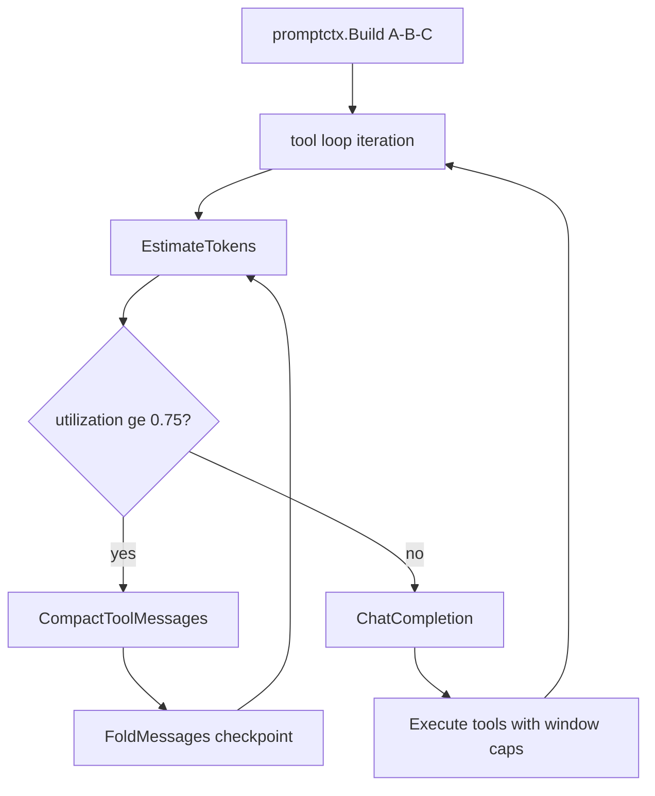

# Code 模式上下文管控设计

**日期：** 2026-08-04  
**范围：** Coder / Agent Chat（`mode=coder`）的 prompt 组装与 tool 循环；不含网关 `/v1/chat/completions` 透传路径。

## 问题

1. 仓库代码动辄远超模型上下文；若整文件/多轮 tool 结果堆积，上游 API 直接超限。  
2. Prompt / KV Cache 需要 **稳定前缀**；压缩若重写整段 history，会与 cache 冲突。  
3. 现有能力（`promptctx.Build`、extractive checkpoint、`TruncateToolResult`、`CompactToolMessages`）方向正确，但 **75% 利用率闸未落地**，`tool_result_keep_recent` / `CompactToolMessages` **未接线**，`read_file` 默认可读到 200KB。

## 目标

- **不超上下文：** 发上游前 `used / budget ≤ 1.0`，达到 **75%** 必须压缩；压完目标落到约 **50–55%**。  
- **利于 Prompt Cache：** 固定 A/B/C 三段；压缩只更新 checkpoint 与中段，不改 system/tools 文案。  
- **代码按需切片：** 默认窗口化读文件；禁止无范围整文件灌入上下文。

## 非目标

- 网关透传路径的服务端 compaction（保持客户端自管）。  
- LLM 长摘要（本阶段仍用 extractive fold；接口预留）。  
- Anthropic 原生 `context_management` API。

## 架构：A / B / C 三段

```text
[A 稳定前缀 · 可 cache]
  system（Coder 身份与规则）
  tools schema
  session checkpoint（摘要，少变）

[B 可压缩中段]
  最近完整对话轮（含 tool 闭环）

[C 可变后缀 · 不追求 cache]
  tree hint / FTS 片段
  当前 user 请求
```

**Cache 断点：** 落在 A 末尾（最后一个 system / checkpoint）；`prompt_cache_enabled` 时继续对末尾 system 打 `cache_control`。

**冲突消解：**

| 机制 | 职责 | 允许的变更 |
|------|------|------------|
| Prompt Cache | 稳住 A | 除 checkpoint 外，system/tools 文案不变 |
| 75% Compaction | 缩短 B，把旧内容写入 checkpoint | 可弄脏 A 一次（更新 checkpoint），随后多轮在新 A 上重新命中 |

禁止：每轮微改 system；把检索片段写入 A；截断半截 tool_use/tool_result。

## 利用率与压缩策略

### 估算

- 沿用 `promptctx.EstimateTokens`（含 tools schema）。  
- `budget = context_budget_tokens`（默认 8000；可配置）。  
- `utilization = used / budget`。

### 触发（Coder tool 循环内 + Build 后）

当 `utilization >= 0.75`：

1. **先** `CompactToolMessages(keep_recent, max_chars)` — 旧 tool_result → 短标记。  
2. 若仍 `>= 0.75`：对 B 中偏旧轮次 `FoldMessages` → checkpoint，推进 cutoff。  
3. 若仍超：从头部丢弃最旧完整轮（保持 tool 闭环完整）。  
4. 压完后若仍 `> 0.95`：**本轮不发 API**，向用户/事件返回「上下文已满，请缩小范围或新开会话」。

压缩目标：`utilization ∈ [0.50, 0.55]`（软目标，非硬失败条件）。

### Checkpoint 触发合并

`MaybeCheckpoint` 改为：

- **利用率 ≥ 75%**，或  
- **消息数达到 `summarize_every_turns`**  

先到先执行；同一会话连续压缩有最小间隔（例如至少再积累 2 轮），避免每轮都改 A。

## 代码工具窗口化

| 工具 | 默认行为 | 硬上限 |
|------|----------|--------|
| `read_file` | 未指定 `limit` 时默认最多 **400 行**；返回带起始行号提示 | 单次输出 ≤ **32KB**（字符）；总行 cap 800 |
| `grep` | 匹配行 + 有限上下文 | 总输出 ≤ **16KB** 或 200 命中（取先到） |
| `search_files` | 路径列表 | 已有 200 条上限，保持 |
| 新 tool_result 入模型 | `TruncateToolResult` | `tool_result_max_chars`（默认 4000） |
| 历史 tool | `CompactToolMessages` | `tool_result_keep_recent`（默认 2） |

`read_file` 描述文案明确：大文件必须传 `offset`/`limit`；超限返回截断说明而非静默灌满。

## Coder 行为约束（system 文案）

在 `coderSystemPrompt` 中增加硬性指引：

- 先 `list_directory` / `grep` / `search_files`，再小范围 `read_file`。  
- 禁止无 offset/limit 连续读取巨型文件；单文件分多段读。  
- 大改动分文件批次，每批只保留相关片段在上下文中。

## 配置（`codegateway.yaml` → `AgentConfig`）

新增/沿用：

```yaml
agent:
  context_budget_tokens: 8000
  context_compact_ratio: 0.75    # 新增：触发压缩阈值
  context_target_ratio: 0.55     # 新增：压完软目标（文档约定，实现可选用）
  history_max_turns: 8
  tool_result_max_chars: 4000
  tool_result_keep_recent: 2     # 接线到 coder 循环
  summarize_every_turns: 10
  read_file_default_lines: 400   # 新增
  read_file_max_bytes: 32768     # 新增
  grep_max_bytes: 16384          # 新增
  prompt_cache_enabled: true
```

## 数据流（Coder 一轮）



## 测试要点

- `read_file` 无 limit 时不超过默认行数 / max bytes。  
- Coder 循环中 `keep_recent` 之外的 tool 内容被压短。  
- `utilization >= 0.75` 时触发 compact；压后 used 下降。  
- Build 布局仍为 system → checkpoint → history → current user。

## 验收标准

1. 大仓库上传后，单轮请求不会因默认 `read_file` 整文件而超 `context_budget`。  
2. 多轮 tool 后旧结果被压缩，前缀 system 文案不变（仅 checkpoint 可变）。  
3. 人为堆满 tool 结果时，75% 闸触发且 API 调用前 used 回落到预算内（或明确拒绝）。
